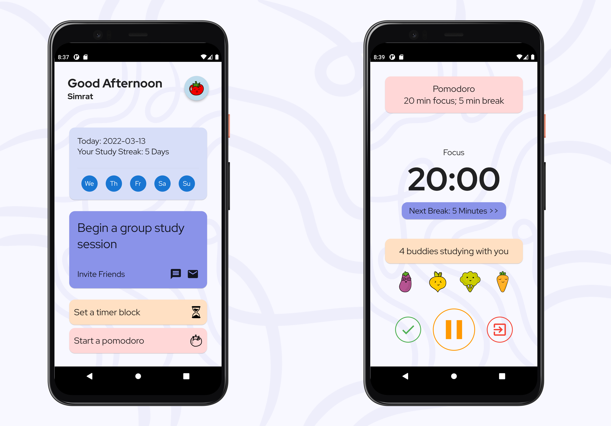

# Study Buddy

Application created during BCIT's Hack-The-Break 2022 Hackathon.
By: Simrat Grewal, Amarra Hong, Eugene Jeong, and Brian Cherng

A beautiful app focused on helping you getting your work done.

## Features 
- Streak Count
- Group Study Session
- Pomodoro Timers
- Block Timers
